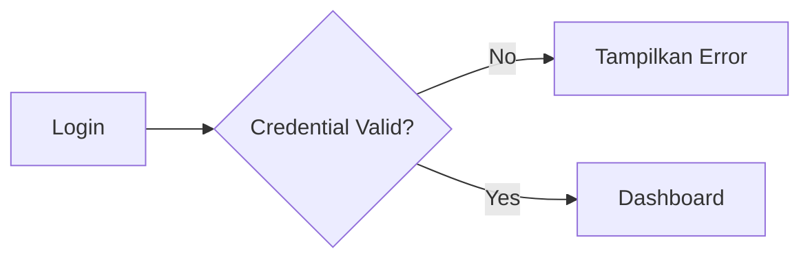
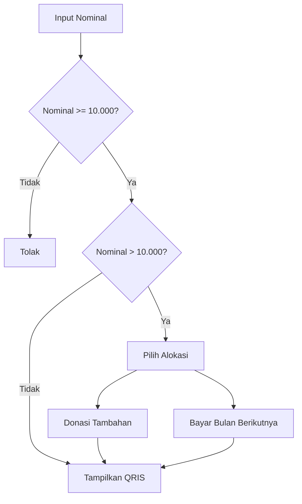

# 04-features.md

# Feature Specification

> Version: 1.0.0
> Status: Draft
> Last Update: July 2026

---

# Overview

Dokumen ini menjelaskan seluruh fitur yang akan dikembangkan pada **Charity Fund Management System (CFMS)** beserta alur bisnis (business flow), hak akses, dan acceptance criteria.

---

# User Roles

| Role   | Description                                                    |
| ------ | -------------------------------------------------------------- |
| Member | Anggota komunitas yang melakukan donasi bulanan.               |
| Admin  | Pengurus yang mengelola anggota, pembayaran, kas, dan laporan. |

---

# Feature List

| Module                  | Member | Admin |
| ----------------------- | :----: | :---: |
| Authentication          |    ✅   |   ✅   |
| Dashboard               |    ✅   |   ✅   |
| Donasi                  |    ✅   |   ❌   |
| Upload Bukti Pembayaran |    ✅   |   ❌   |
| Riwayat Donasi          |    ✅   |   ✅   |
| Verifikasi Pembayaran   |    ❌   |   ✅   |
| Kelola User             |    ❌   |   ✅   |
| Dashboard Keuangan      |    ❌   |   ✅   |
| Pencairan Dana          |    ❌   |   ✅   |
| Laporan                 |    ❌   |   ✅   |
| Pengaturan Sistem       |    ❌   |   ✅   |

---

# 1. Authentication

## Description

Setiap anggota wajib memiliki akun untuk mengakses sistem.

---

## Features

* Login
* Logout
* Session Management
* Role Based Access Control

---

## Flow



---

## Acceptance Criteria

* Email dan password tervalidasi.
* Password disimpan dalam bentuk hash.
* Session berakhir setelah logout.

---

# 2. Dashboard Member

## Description

Dashboard utama yang menampilkan ringkasan kontribusi anggota.

---

## Information Displayed

* Nama
* Total Donasi
* Total Pembayaran
* Status Bulan Berjalan
* Progress Donasi
* Riwayat Terakhir

---

## Example

```text
Halo, Pajar

Total Donasi
Rp850.000

Sudah Berdonasi
85 Kali

Status Bulan Ini

✔ Lunas

Riwayat Terakhir

10 Juli 2026
Rp20.000
Verified
```

---

## Acceptance Criteria

* Data tampil sesuai akun yang login.
* Informasi diperbarui secara real-time setelah pembayaran diverifikasi.

---

# 3. Donasi

## Description

Member dapat melakukan pembayaran iuran maupun donasi tambahan.

---

## Business Rules

* Minimal pembayaran Rp10.000.
* Nominal dapat melebihi Rp10.000.
* Sistem meminta pilihan alokasi apabila nominal melebihi kewajiban.

---

## Flow



---

## Allocation Option

Misal pembayaran:

```text
Rp30.000
```

Sistem akan menampilkan:

```text
Sisa Rp20.000 ingin digunakan sebagai:

( ) Donasi tambahan

( ) Pembayaran bulan berikutnya
```

---

## Acceptance Criteria

* Minimal nominal Rp10.000.
* Pilihan alokasi muncul otomatis.
* Data pembayaran tersimpan sebagai Pending.

---

# 4. QRIS Payment

## Description

Sistem menggunakan **QRIS Merchant Statis**.

Tidak menggunakan payment gateway agar tidak dikenakan biaya transaksi tambahan dari gateway.

---

## Flow

```mermaid
flowchart TD

A[Input Nominal]

↓

B[Tampilkan QRIS Merchant]

↓

C[Transfer]

↓

D[Upload Bukti]

↓

E[Pending Verification]
```

---

## Acceptance Criteria

* QRIS dapat dilihat oleh user.
* Bukti pembayaran wajib diunggah.
* Status awal adalah Pending.

---

# 5. Upload Bukti Pembayaran

## Description

Member mengunggah screenshot bukti pembayaran setelah transfer.

---

## Allowed Format

* JPG
* JPEG
* PNG

---

## Maximum Size

5 MB

---

## Acceptance Criteria

* File tervalidasi.
* Bukti dapat dilihat Admin.

---

# 6. Riwayat Donasi

## Description

Menampilkan seluruh transaksi yang pernah dilakukan.

---

## Information

* Nominal
* Tanggal
* Status
* Jenis Donasi
* Bulan yang Dibayar

---

## Status

* Pending
* Verified
* Rejected

---

## Acceptance Criteria

* Riwayat diurutkan berdasarkan tanggal terbaru.
* Data dapat dipaginasi.

---

# 7. Dashboard Admin

## Description

Dashboard untuk memantau kondisi kas komunitas.

---

## KPI

* Total Kas
* Total Donasi
* Total Pengeluaran
* Saldo
* Jumlah Member
* Pembayaran Pending

---

## Charts

* Pemasukan Bulanan
* Pengeluaran Bulanan
* Donasi Tahunan

---

## Acceptance Criteria

* Statistik dihitung otomatis.
* Grafik diperbarui ketika data berubah.

---

# 8. Verifikasi Pembayaran

## Description

Admin melakukan validasi bukti pembayaran.

---

## Actions

* Approve
* Reject

---

## Flow

```mermaid
flowchart LR

Pending

-->

Admin Review

-->

Decision

Decision --> Verified

Decision --> Rejected
```

---

## Acceptance Criteria

* Hanya Admin yang dapat melakukan verifikasi.
* Saldo bertambah setelah status Verified.

---

# 9. Manajemen User

## Description

Admin mengelola seluruh anggota.

---

## Features

* Tambah User
* Edit User
* Nonaktifkan User
* Reset Password

---

## Acceptance Criteria

* Email harus unik.
* Password dihasilkan secara aman.

---

# 10. Pencairan Dana

## Description

Digunakan ketika dana disalurkan untuk santunan.

---

## Input

* Nominal
* Tanggal
* Keterangan

---

## Formula

```text
Saldo Baru

=

Saldo Lama

-

Nominal Pencairan
```

---

## Acceptance Criteria

* Saldo tidak boleh negatif.
* Riwayat pencairan tersimpan.

---

# 11. Target Santunan

## Description

Menghitung jumlah anak yatim yang dapat disantuni.

---

## Input

Target santunan per anak.

Contoh

```text
Rp70.000
```

---

## Formula

```text
Jumlah Anak

=

Saldo Kas

/

Target Santunan Per Anak
```

---

## Example

```text
Saldo

Rp5.600.000

Target

Rp70.000

=

80 Anak
```

---

## Acceptance Criteria

* Perhitungan otomatis.
* Hasil selalu diperbarui ketika saldo berubah.

---

# 12. Financial Report

## Description

Admin dapat menghasilkan laporan.

---

## Report

* Kas Masuk
* Kas Keluar
* Saldo
* Daftar Donasi
* Daftar Pencairan

---

## Export

* PDF
* Excel

---

## Acceptance Criteria

* Laporan sesuai filter tanggal.
* Data akurat.

---

# 13. Audit Log

## Description

Seluruh aktivitas penting dicatat.

---

## Recorded Activity

* Login
* Logout
* Payment Created
* Payment Verified
* Payment Rejected
* Withdrawal Created
* User Updated

---

## Acceptance Criteria

* Tidak dapat diubah oleh Member.
* Dapat difilter berdasarkan tanggal dan pengguna.

---

# 14. Notification

## Description

Mengirim pemberitahuan kepada anggota.

---

## Trigger

* Pembayaran Diverifikasi
* Pembayaran Ditolak
* Pengingat Donasi Bulanan

---

## Delivery

* In-App Notification
* Email (Future Version)

---

# Feature Roadmap

| Feature               | MVP | v1.1 | v2.0 |
| --------------------- | :-: | :--: | :--: |
| Authentication        |  ✅  |      |      |
| Dashboard Member      |  ✅  |      |      |
| Dashboard Admin       |  ✅  |      |      |
| Donasi                |  ✅  |      |      |
| Upload Bukti          |  ✅  |      |      |
| Verifikasi Pembayaran |  ✅  |      |      |
| Pencairan Dana        |  ✅  |      |      |
| Laporan PDF           |  ✅  |      |      |
| Export Excel          |  ✅  |      |      |
| Notification          |  ✅  |      |      |
| Audit Log             |  ✅  |      |      |
| OCR Bukti Pembayaran  |     |   ✅  |      |
| WhatsApp Notification |     |   ✅  |      |
| QRIS Dynamic          |     |      |   ✅  |
| Auto Verification     |     |      |   ✅  |
| Multi Organization    |     |      |   ✅  |

---

# MVP Checklist

## Member

* Login
* Dashboard
* Donasi
* Upload Bukti Pembayaran
* Riwayat Donasi
* Profil

---

## Admin

* Dashboard
* Kelola User
* Verifikasi Pembayaran
* Pencairan Dana
* Laporan
* Target Santunan
* Pengaturan Sistem

---

# Conclusion

Versi **MVP** difokuskan pada digitalisasi proses donasi dan administrasi kas komunitas secara sederhana namun transparan. Arsitektur dan business flow telah disiapkan agar mudah dikembangkan pada versi berikutnya tanpa perlu mengubah fondasi sistem.
