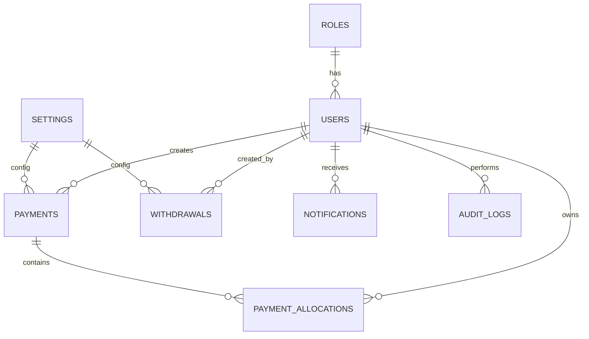
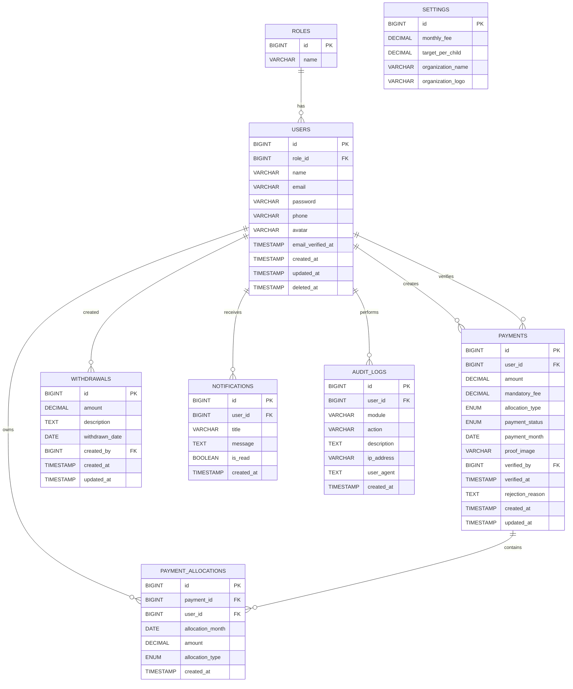
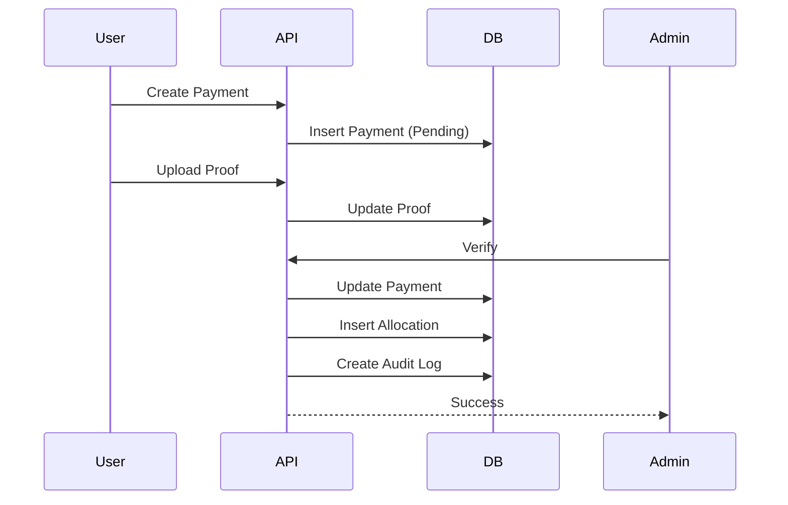

# 06-database.md

# Database Design

> Version: 1.0.0
> Database : MySQL 9
> Last Update : July 2026

---

# Overview

Dokumen ini menjelaskan rancangan database **Charity Fund Management System (CFMS)**.

Database dirancang menggunakan prinsip:

* Third Normal Form (3NF)
* Referential Integrity
* Soft Delete
* Auditability
* Future Scalability

---

# Database Overview



---

# Database Tables

| Table               | Purpose            |
| ------------------- | ------------------ |
| roles               | Hak akses          |
| users               | Data anggota       |
| payments            | Donasi             |
| payment_allocations | Alokasi pembayaran |
| withdrawals         | Pencairan dana     |
| settings            | Konfigurasi sistem |
| notifications       | Notifikasi         |
| audit_logs          | Audit aktivitas    |

---

# roles

Menyimpan daftar role sistem.

| Field      | Type        | Constraint |
| ---------- | ----------- | ---------- |
| id         | BIGINT      | PK         |
| name       | VARCHAR(30) | UNIQUE     |
| created_at | TIMESTAMP   |            |
| updated_at | TIMESTAMP   |            |

---

Example

| id | name   |
| -- | ------ |
| 1  | Admin  |
| 2  | Member |

---

# users

Data seluruh anggota.

| Field             | Type         | Constraint  |
| ----------------- | ------------ | ----------- |
| id                | BIGINT       | PK          |
| role_id           | BIGINT       | FK          |
| name              | VARCHAR(150) |             |
| email             | VARCHAR(150) | UNIQUE      |
| password          | VARCHAR(255) |             |
| phone             | VARCHAR(30)  | NULL        |
| avatar            | VARCHAR(255) | NULL        |
| email_verified_at | TIMESTAMP    | NULL        |
| created_at        | TIMESTAMP    |             |
| updated_at        | TIMESTAMP    |             |
| deleted_at        | TIMESTAMP    | Soft Delete |

---

Relationship

```text
Role

1

↓

Many Users
```

---

# payments

Menyimpan seluruh transaksi donasi.

| Field            | Type          | Constraint                |
| ---------------- | ------------- | ------------------------- |
| id               | BIGINT        | PK                        |
| user_id          | BIGINT        | FK                        |
| amount           | DECIMAL(12,2) |                           |
| mandatory_fee    | DECIMAL(12,2) | Default 10000             |
| allocation_type  | ENUM          | DONATION, NEXT_MONTH      |
| payment_status   | ENUM          | PENDING VERIFIED REJECTED |
| payment_month    | DATE          | Bulan yang dibayar        |
| proof_image      | VARCHAR(255)  |                           |
| verified_by      | BIGINT        | FK Users                  |
| verified_at      | TIMESTAMP     | NULL                      |
| rejection_reason | TEXT          | NULL                      |
| created_at       | TIMESTAMP     |                           |
| updated_at       | TIMESTAMP     |                           |

---

Business Rules

Minimal

```text
Rp10.000
```

Status

```text
Pending

↓

Verified

↓

Rejected
```

---

# payment_allocations

Menyimpan pembagian pembayaran apabila user membayar lebih dari Rp10.000.

Contoh

Bayar

```text
Rp35.000
```

Disimpan menjadi

| Bulan     | Iuran    | Donasi  |
| --------- | -------- | ------- |
| Juli      | Rp10.000 | -       |
| Agustus   | Rp10.000 | -       |
| September | Rp10.000 | -       |
| Juli      | -        | Rp5.000 |

---

Schema

| Field            | Type                   |
| ---------------- | ---------------------- |
| id               | BIGINT                 |
| payment_id       | BIGINT FK              |
| user_id          | BIGINT FK              |
| allocation_month | DATE                   |
| amount           | DECIMAL(12,2)          |
| allocation_type  | ENUM(MONTHLY,DONATION) |
| created_at       | TIMESTAMP              |

---

Kenapa tabel ini dipisah?

Supaya business rule fleksibel.

Misalnya nanti user bayar

```text
Rp120.000
```

Bisa langsung dialokasikan menjadi

12 bulan

Tanpa mengubah struktur database.

---

# withdrawals

Pencairan dana santunan.

| Field          | Type          |
| -------------- | ------------- |
| id             | BIGINT        |
| amount         | DECIMAL(12,2) |
| description    | TEXT          |
| withdrawn_date | DATE          |
| created_by     | BIGINT FK     |
| created_at     | TIMESTAMP     |
| updated_at     | TIMESTAMP     |

---

Example

| Nominal | Keterangan        |
| ------- | ----------------- |
| 700000  | Santunan Muharram |

---

# settings

Konfigurasi sistem.

Karena nilai dapat berubah setiap tahun.

Misalnya

```text
Iuran

10.000

↓

15.000
```

Tidak perlu mengubah source code.

---

Schema

| Field             | Type          |
| ----------------- | ------------- |
| id                | BIGINT        |
| monthly_fee       | DECIMAL(12,2) |
| target_per_child  | DECIMAL(12,2) |
| organization_name | VARCHAR(255)  |
| organization_logo | VARCHAR(255)  |
| created_at        | TIMESTAMP     |
| updated_at        | TIMESTAMP     |

---

# notifications

Notifikasi pengguna.

| Field      | Type         |
| ---------- | ------------ |
| id         | BIGINT       |
| user_id    | BIGINT FK    |
| title      | VARCHAR(255) |
| message    | TEXT         |
| is_read    | BOOLEAN      |
| created_at | TIMESTAMP    |

---

# audit_logs

Seluruh aktivitas sistem.

| Field       | Type         |
| ----------- | ------------ |
| id          | BIGINT       |
| user_id     | BIGINT FK    |
| module      | VARCHAR(100) |
| action      | VARCHAR(100) |
| description | TEXT         |
| ip_address  | VARCHAR(100) |
| user_agent  | TEXT         |
| created_at  | TIMESTAMP    |

---

Example Activity

```text
LOGIN

CREATE_PAYMENT

VERIFY_PAYMENT

REJECT_PAYMENT

CREATE_WITHDRAWAL

UPDATE_PROFILE
```

---

# Entity Relationship Diagram (Detailed)



---

# Database Index

## users

```sql
email UNIQUE

role_id INDEX
```

---

## payments

```sql
user_id INDEX

payment_status INDEX

payment_month INDEX

verified_by INDEX
```

---

## payment_allocations

```sql
payment_id INDEX

user_id INDEX

allocation_month INDEX
```

---

## withdrawals

```sql
withdrawn_date INDEX
```

---

## notifications

```sql
user_id INDEX

is_read INDEX
```

---

## audit_logs

```sql
user_id INDEX

module INDEX

action INDEX

created_at INDEX
```

---

# Soft Delete Strategy

Menggunakan Soft Delete pada tabel:

* users

Hal ini menjaga integritas histori transaksi. Ketika seorang anggota keluar dari komunitas, data donasi dan audit tetap tersimpan.

---

# Database Transaction Flow



---

# Estimated Database Growth

Dengan asumsi:

* 20 anggota
* ±1 transaksi per bulan
* 5 tahun penggunaan

Estimasi data:

| Table               | Estimated Rows |
| ------------------- | -------------: |
| users               |             50 |
| payments            |          1.200 |
| payment_allocations |          2.000 |
| withdrawals         |            100 |
| notifications       |          5.000 |
| audit_logs          |         15.000 |

Ukuran database diperkirakan masih jauh di bawah 100 MB, sehingga MySQL tunggal sudah lebih dari cukup.

---

# Future Database

Apabila sistem berkembang menjadi platform untuk banyak komunitas, tabel berikut dapat ditambahkan:

* organizations
* organization_members
* organization_settings
* payment_methods
* payment_receipts
* report_exports
* scheduled_jobs

Sehingga arsitektur dapat berkembang menjadi **multi-tenant** tanpa perlu melakukan redesign besar terhadap struktur database yang ada.
