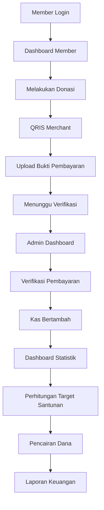

# 01-vision.md

# Charity Fund Management System (CFMS)

> Version: 1.0.0
> Status: Draft
> Last Update: July 2026

---

# Vision

Membangun sebuah sistem manajemen donasi yang **transparan, terpercaya, dan mudah digunakan** untuk membantu komunitas mengelola iuran bulanan serta penyaluran santunan anak yatim secara digital.

Sistem ini bertujuan menghilangkan proses pencatatan manual, mempermudah administrasi, meningkatkan transparansi keuangan, serta memastikan setiap anggota dapat memantau kontribusinya secara mandiri.

---

# Mission

Untuk mewujudkan visi tersebut, sistem akan berfokus pada beberapa misi berikut:

* Mendigitalisasi seluruh proses pencatatan donasi.
* Memberikan transparansi penuh terhadap pemasukan dan pengeluaran dana.
* Mempermudah anggota dalam melakukan donasi bulanan.
* Mempermudah admin dalam mengelola kas komunitas.
* Menghasilkan laporan keuangan yang akurat dan mudah dipahami.
* Menjadi fondasi sistem yang dapat dikembangkan di masa depan.

---

# Problem Statement

Saat ini proses pengelolaan kas komunitas masih dilakukan secara manual sehingga menimbulkan beberapa permasalahan, di antaranya:

* Sulit mengetahui anggota yang sudah atau belum melakukan donasi.
* Riwayat pembayaran tidak terdokumentasi dengan baik.
* Rekapitulasi kas memerlukan waktu dan berpotensi terjadi kesalahan pencatatan.
* Tidak tersedia laporan keuangan yang transparan.
* Perhitungan jumlah anak yatim yang dapat disantuni dilakukan secara manual.

Permasalahan tersebut menyebabkan proses administrasi menjadi kurang efisien dan menyulitkan pengambilan keputusan.

---

# Product Vision

Charity Fund Management System bukan hanya aplikasi pencatat kas, tetapi merupakan platform internal yang membantu komunitas mengelola seluruh siklus donasi, mulai dari pembayaran anggota, verifikasi transaksi, pencatatan kas, hingga pencairan dana santunan secara terstruktur dan transparan.

---

# Objectives

## Short-Term Objectives

* Menggantikan pencatatan manual menjadi sistem digital.
* Menyediakan dashboard bagi anggota dan admin.
* Menyediakan histori donasi setiap anggota.
* Menampilkan kondisi kas secara real-time.
* Menghasilkan laporan keuangan otomatis.

---

## Long-Term Objectives

* Menjadi sistem standar pengelolaan kas komunitas.
* Mendukung banyak komunitas (Multi Organization).
* Integrasi pembayaran otomatis.
* Notifikasi otomatis melalui Email atau WhatsApp.
* Dashboard analitik yang lebih komprehensif.
* Integrasi OCR untuk validasi bukti pembayaran.
* AI Insight untuk analisis tren donasi.

---

# Project Scope

## In Scope

### Authentication

* Login
* Logout
* Role Based Access Control

---

### Member Module

* Dashboard
* Riwayat Donasi
* Status Pembayaran
* Donasi
* Upload Bukti Pembayaran
* Profil

---

### Admin Module

* Dashboard
* Verifikasi Pembayaran
* Manajemen User
* Riwayat Transaksi
* Pencairan Dana
* Laporan
* Pengaturan Target Santunan

---

### Financial Module

* Kas Masuk
* Kas Keluar
* Saldo
* Statistik Bulanan
* Perhitungan Target Santunan

---

## Out of Scope (Version 1)

Fitur berikut belum termasuk dalam versi pertama:

* QRIS Dynamic
* Payment Gateway
* Auto Verification
* Multi Community
* Mobile Push Notification
* WhatsApp Gateway
* OCR Bukti Pembayaran
* AI Chatbot
* AI Financial Analytics

---

# Target Users

## Member

Anggota komunitas yang melakukan donasi secara berkala.

Kebutuhan utama:

* Melihat status donasi.
* Melakukan pembayaran.
* Melihat histori pembayaran.
* Memantau total kontribusi.

---

## Administrator

Pengurus kas komunitas.

Kebutuhan utama:

* Memverifikasi pembayaran.
* Mengelola anggota.
* Mengelola pencairan dana.
* Memantau kondisi kas.
* Menghasilkan laporan.

---

# Product Principles

Seluruh pengembangan sistem harus mengikuti prinsip berikut:

## Transparency

Seluruh transaksi dapat dilihat sesuai hak akses masing-masing sehingga meningkatkan kepercayaan antaranggota.

---

## Simplicity

Antarmuka sederhana sehingga mudah digunakan oleh seluruh anggota tanpa memerlukan pelatihan khusus.

---

## Accountability

Seluruh transaksi memiliki riwayat dan audit log sehingga dapat dipertanggungjawabkan.

---

## Flexibility

Sistem mendukung pembayaran melebihi iuran minimum dengan pilihan alokasi sebagai donasi tambahan atau pembayaran untuk bulan berikutnya.

---

## Scalability

Arsitektur dirancang agar dapat dikembangkan ketika jumlah anggota bertambah atau kebutuhan sistem meningkat.

---

# Success Indicators

Sistem dianggap berhasil apabila:

* 100% anggota menggunakan sistem untuk pencatatan donasi.
* Seluruh transaksi tercatat secara digital.
* Tidak ada lagi pencatatan kas manual.
* Waktu rekapitulasi kas berkurang secara signifikan.
* Perhitungan target santunan dilakukan otomatis.
* Laporan keuangan dapat dihasilkan kapan saja.

---

# Business Value

## Bagi Anggota

* Transparansi donasi.
* Riwayat pembayaran yang terdokumentasi.
* Kemudahan melakukan pembayaran.
* Meningkatkan kepercayaan terhadap pengelolaan kas.

---

## Bagi Admin

* Mengurangi pekerjaan administratif.
* Mempermudah verifikasi pembayaran.
* Mempermudah penyusunan laporan.
* Meminimalkan human error.

---

## Bagi Komunitas

* Pengelolaan kas menjadi lebih profesional.
* Data keuangan lebih akurat.
* Transparansi meningkatkan kepercayaan anggota.
* Mempermudah perencanaan kegiatan santunan.

---

# Vision Diagram

---

# Vision Statement

> **"Membangun platform manajemen donasi yang sederhana, transparan, dan terpercaya untuk membantu komunitas mengelola iuran bulanan serta menyalurkan santunan kepada anak yatim secara efektif, akuntabel, dan berkelanjutan."**
